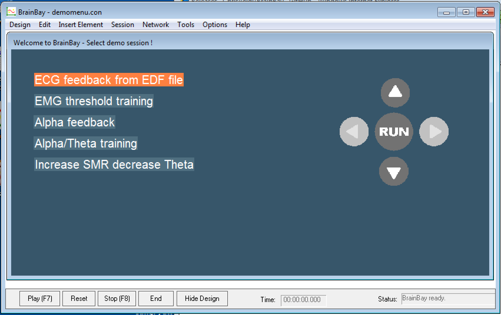

# BrainBay

From their OpenBCI tutorials page: BrainBay is an open-source visual programming language (VPL) for rapid prototyping of EEG digital signal processing steps (or data flows.) 

They recently added an OpenBCI driver to their software, making it easy to use BrainBay with OpenBCI products!

## Setting Up Your Environment

**Windows:** BrainBay only works with the Windows operating system.

**MacOS and Linux:** If you have Mac OS or Linux, you can use BrainBay through a virtual machine program like VirtualBox. Check out our VirtualBox tutorial [here!](http://docs.openbci.com/Tutorials/12-Win7_VM_Installation)

## Installation

Click on the download link for the lastest version of BrainBay here: (http://www.shifz.org/brainbay/). If you're using a virtual machine, be sure to download and set up BrainBay from within the VM environment.

Click **Setup_BrainBay_v2.1.exe**, or the equivalent .exe for the latest version, and follow the prompts to run the program. When you're finished, a BrainBay icon should appear on your desktop.

## Getting Started

Double-clicking the BrainBay icon will open a demo screen. To learn more about BrainBay's capabilities, click on one of the demo options.

To begin using BrainBay yourself, click on Design -> New from the toolbar at the top of the screen.

You're now ready to use BrainBay for EEG streaming and analysis!

## Live Stream from OpenBCI to BrainBay

To stream data live from your OpenBCI board within a BrainBay design, select Insert Element -> Source -> Biosignal/EEG Amplifier and one of the OpenBCI devices. I'm using a Cyton board (without the Daisy extension), so I selected "OpenBCI 8 Channels".

BrainBay does have an "import data from file" option, but it is only compatible with archive (.arc) files. The OpenBCI GUI saves data as comma-delineated .txt files. So, unless you have another application that saves data from your OpenBCI board as .arc files, you need to stream data live to use BrainBay. 

After selecting your device, select your device's COM port. If you're using VirtualBox, our [VirtualBox tutorial](http://docs.openbci.com/Tutorials/12-Win7_VM_Installation) has a section on finding the COM port of a connected hardware device. 

Click "Connect/Disconnect". A checkmark should appear in the "connected:" box. 

Exit out of the device configuration window. A image corresponding to your OpenBCI board should have appeared in your design window, like below. Re-open the configuration window at any time by right-clicking on the image. 

You're now streaming data from your board! In the next section, we'll show a simple application of 

## Quick Project: Using the Oscilloscope Tool

BrainBay has a wide variety of useful tools for streaming EEG data. To get familiar with BrainBay's interface, and to double-check our board is streaming data, we'll show how to use the Oscilloscope tool. 

Select Insert Element -> Target -> Oscilloscope from the toolbar.

A box representing the oscilloscope will appear in the "Design" window. Drag it off the box representing your OpenBCI board if necessary.

Want to learn more about BrainBay's capabilities with OpenBCI hardware? Check out their [BrainBay & OpenBCI tutorials](https://sites.google.com/site/biofeedbackpages/brainbay-openbci) page. 

## Documentation

Documentation for the BrainBay software can be found here: (http://www.shifz.org/brainbay/)

Did you use BrainBay and OpenBCI to build something new? Post about it on our [community page!](http://openbci.com/community/)

