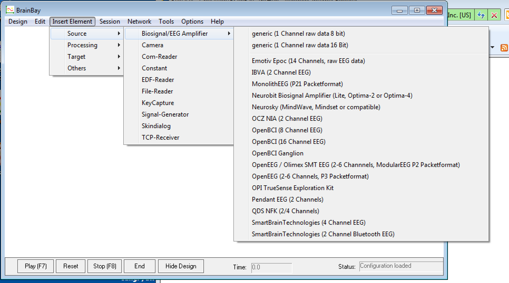
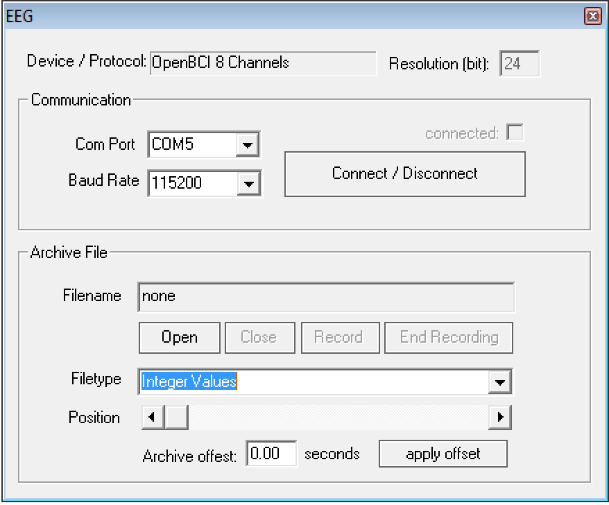

# BrainBay

## Setting Up Your Environment

**Windows:** BrainBay only works with the Windows operating system.

**MacOS and Linux:** If you have Mac OS or Linux, you can use BrainBay through a virtual machine program like VirtualBox. Check out our VirtualBox tutorial [here!](http://docs.openbci.com/Tutorials/12-Win7_VM_Installation)

## Installation

Click on the download link for the lastest version of BrainBay here: (http://www.shifz.org/brainbay/). If you're using a virtual machine, be sure to download and set up BrainBay from within the VM environment.

Click **Setup_BrainBay_v2.1.exe**, or the equivalent .exe for the latest version, and follow the prompts to run the program. When you're finished, a BrainBay icon should appear on your desktop.

## Getting Started

Double-clicking the BrainBay icon will open a demo screen. To learn more about BrainBay's capabilities, click on one of the demo options.

To begin using BrainBay yourself, click on Design -> New from the toolbar at the top of the screen.

You're now ready to use BrainBay for EEG streaming and analysis!

## Using BrainBay with OpenBCI

To use BrainBay with data from an OpenBCI board, either live or from a file, select Insert Element -> Source -> Biosignal/EEG Amplifier and one of the OpenBCI devices. 

Once you select a device, you'll have the option to communicate with it live or read from file. 

Want to learn more about BrainBay's capabilities with OpenBCI hardware? Check out their [BrainBay & OpenBCI tutorials](https://sites.google.com/site/biofeedbackpages/brainbay-openbci) page. 

## Documentation

Documentation for the BrainBay software can be found here: (http://www.shifz.org/brainbay/)

Did you use BrainBay and OpenBCI to build something new? Post about it on our [community page!](http://openbci.com/community/)

