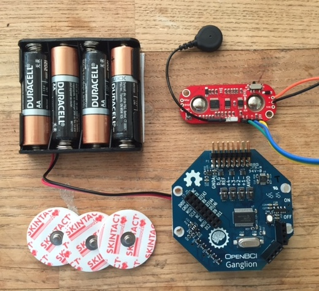
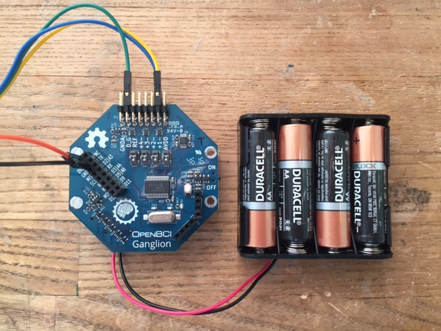
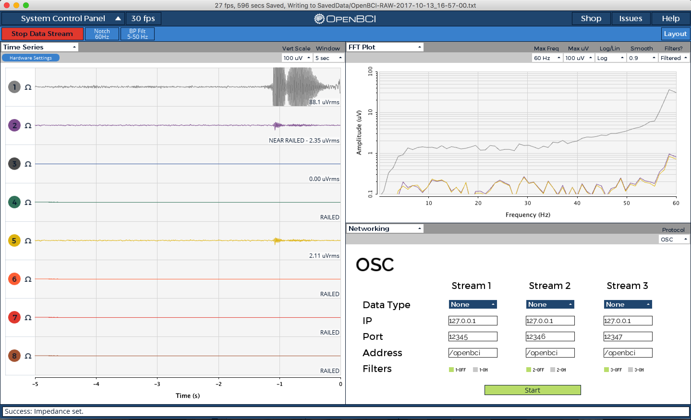
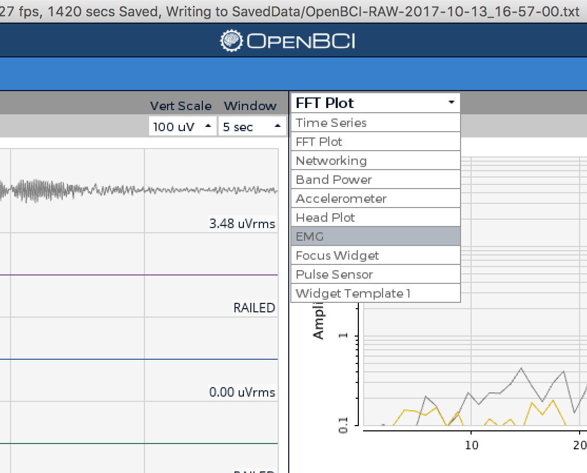
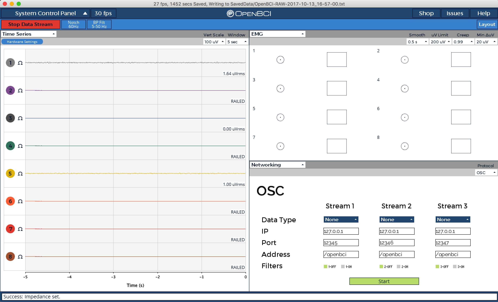
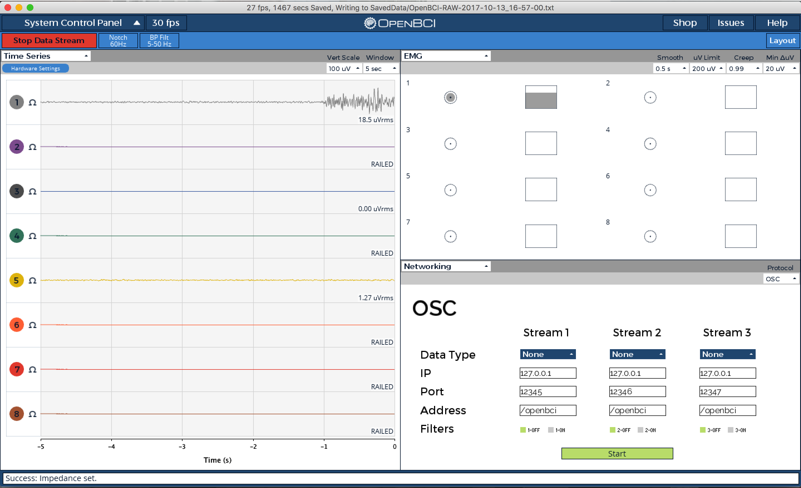

# MyoWare OpenBCI Integration (Ganglion Board)

### Overview
This tutorial will set you up to read EMG data (electrical signals from muscles) using a MyoWare board, an OpenBCI Ganglion board, and the OpenBCI GUI. If you have a Cyton board instead, check out our [Cyton board MyoWare integration tutorial instead!](http://docs.openbci.com/Tutorials/14-MyoWare_Integration)

### Materials Needed

1. MyoWare board
2. OpenBCI Ganglion board, with power source
4. Skintact sticky electrodes (for using the MyoWare board)
5. Soldering iron and materials
6. Two male-male jumper wires (like [these](https://www.adafruit.com/product/266)), and three male-female jumper wires (like [these](https://www.adafruit.com/product/826))

Note: jumper wires aren't sold on the OpenBCI website, but we used the ones from Adafruit (linked above) for this tutorial

### 1. Soldering the MyoWare Headers
Solder 5 wires to the MyoWare board as shown below. Solder the male-male wires to the "+" and "-" connects, and the male-female wires to the R, E, and M connects.

The wires attached to the "+" and "-" connects will be used to supply power to the board. They'll be attached to high voltage and ground outputs on the OpenBCI Ganglion board.

The wires attached to the R, E, and M connects will transmit electrical signals from MyoWare's three electrodes to the OpenBCI Ganglion board. R is the reference electrode, the one attached to the black wire. M is the middle electrode, and E is the end electrode. The E and M electrodes will measure activity across a muscle. 

### 2. Preparing OpenBCI Ganglion Board
Your Ganglion board should look like this:

If your Ganglion board is missing the black, female pin connectors (called "headers") sticking out of the board, you will need to solder them on before continuing. 

### 3. Wiring the MyoWare Board to the OpenBCI Ganglion Board 
Connect the 5 wires from the MyoWare board in step 1 to the Ganglion board, as shown below:

The "+" and "-" from the MyoWare board should go to the DVDD and GND connects on the left side of the Ganglion board. R, E, and M will connect to the pins at the top.

The wires should be connected like this:

| MyoWare Board | OpenBCI Ganglion Board |
| -------------- | -------------- |
| \+ | DVDD |
| \- | GND |
| R | D_G (top pin) |
| E | 1- (bottom pin) |
| M | 1+ (top pin) |

R, "+", and "-" must always go to the pins shown above. E and M can also be connected to 2+ and 2- (the top and bottom "2" pins), or 3+ and 3-, or 4+ and 4-.

When you have everything wired up, set the power switch on the MyoWare board to "on". Turn on the OpenBCI Ganglion board, turn on your computer's Bluetooth feature, and start the OpenBCI GUI software. If you're new to using a Ganglion board with your computer, take a look at the Ganglion Getting Started Guide (http://docs.openbci.com/Tutorials/02-Ganglion_Getting%20Started_Guide).

### 4. Streaming EMG Data with the OpenBCI GUI

Attach three Skintact electrodes to the three electrodes on the MyoWare board, and then stick the board on a muscle you'd like to monitor. The Adafruit MyoWare tutorial has good guidelines for MyoWare board placement: (https://learn.adafruit.com/getting-started-with-myoware-muscle-sensor/placing-electrodes).

You'll be able to see signals from the MyoWare electrodes in the OpenBCI GUI. If you connected E and M to the 1- and 1+ pins on the OpenBCI Ganglion board, then the MyoWare data will appear in channel 1. 

Here's what the GUI, and channel 1, will look like with the muscle at rest:

And here's what channel 1 will look like after flexing the muscle:

### 5. Using OpenBCI's EMG GUI Widget

The OpenBCI GUI also has a widget for visualizing EMG data. To view it, click on the drop down menu under "FFT Plot", and select "EMG" instead:

Each circle and box represents a channel. The circle and box fill up as the intensity of the signal on that channel increases.

Here's what happens to the GUI when a muscle is flexed a little (top) or very strongly (bottom):

You can use these events to trigger analog or digital events from within the GUI as you like. Check out the `EMG_Widget.pde` file for more information on the EMG widget.
